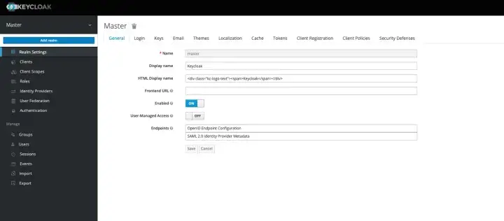
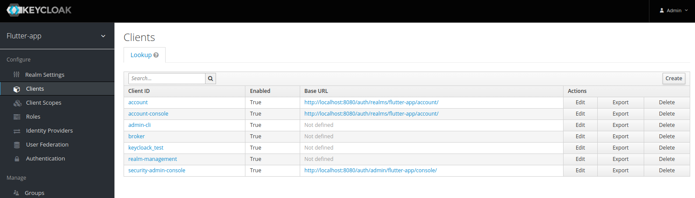
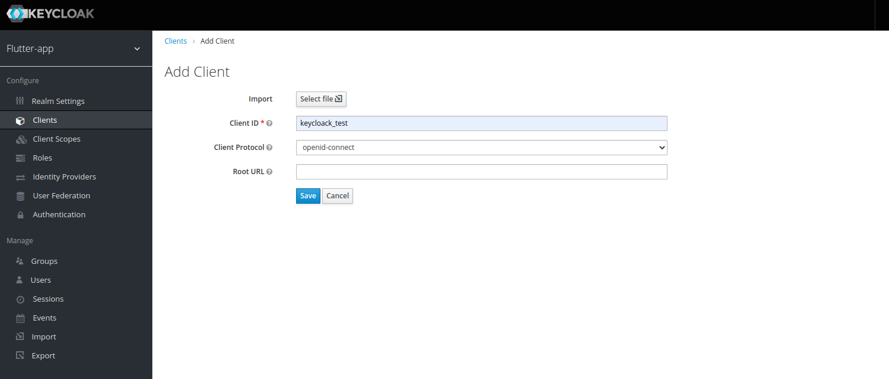
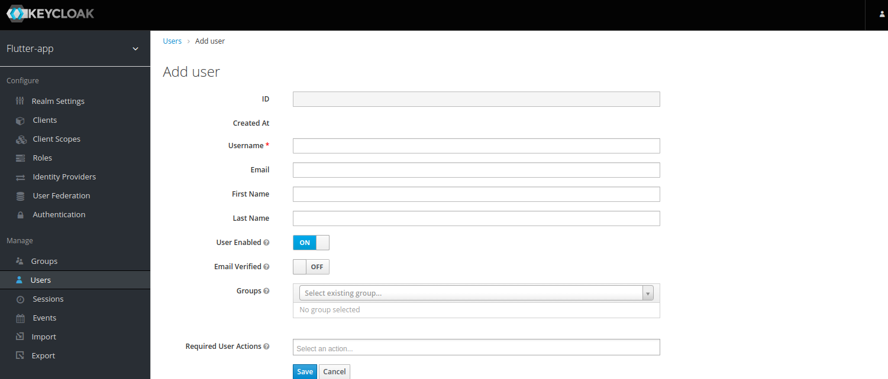
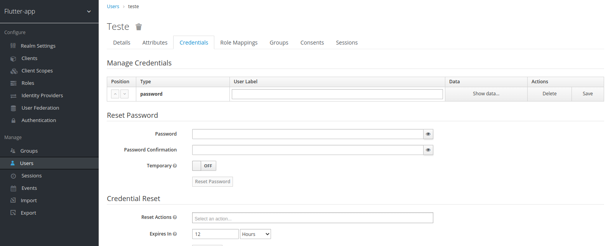
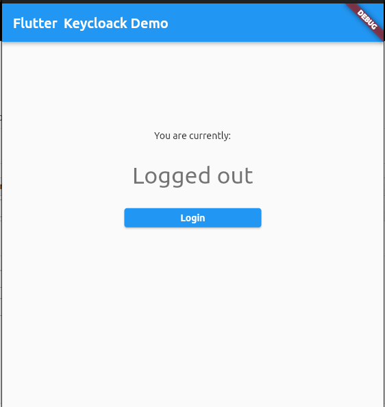
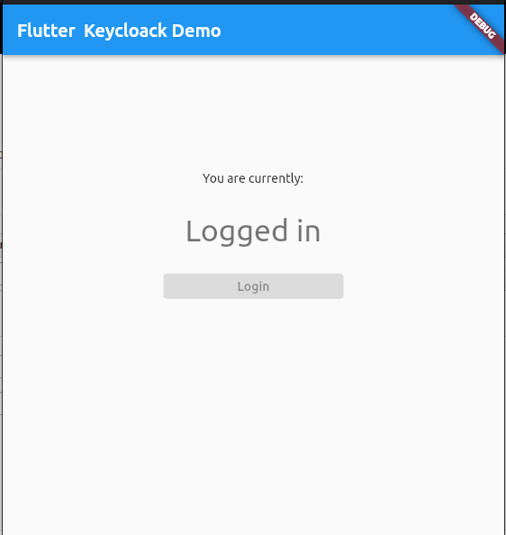

### Exemplo prático de login de uma aplicação Flutter + Keycloack

- [Instale Docker](https://docs.docker.com/engine/install/) no seu sistema.
- Baixe a imagem do Keycloak: 
  ```sh
  docker pull jboss/keycloak
  ```
- Após finalizar, suba a imagem com o seguinte comando:
  ```sh
  docker run -e KEYCLOAK_USER=admin -e KEYCLOAK_PASSWORD=admin -p 8080:8080 jboss/keycloak
  ```
- Após a imagem subir, vá até a url administrativa do Keycloack: http://localhost:8080/auth/

- Logue utilizando `admin` tanto para usuário quanto para senha.
- Clique em `Administration Console` e após isso `Add realm`.

- Nomeie seu realm como `flutter-app` e salve.
- Adicione um novo client indo em `Clients`, e licando em `Create` no canto direito.

- Coloque seu `Client ID` como `keycloack_test` e salve.

- Volte ao menu `Clients` e selecione o client criado e sete a opção `Access Type` como `confidential` e a opção `Valid Redirect URIs` deixe somente um `/` para que possa salvar.
- Após isso volte a esse mesmo client pelo menu e clique na opção `Credentials` que fica ao lado direito de `Settings` e caso já tenha um `Secret` gerado, copie ele e cole na variavel `CLIENT_SECRET` localizada dentro do arquivo `env.dart`
- Adicione um usuário de teste indo no menu lateral direito em `Manage > Users` e clicando em `Add user`.

- Informe o `Username` como `teste`, certifique-se de que a opção `User Enable` está setada como `ON` e clique em salvar.
- Retorne ao menu `Users`, procure o usuário criado acesse ele e selecione o menu `Credentials`.

- Em `Reset Password` informe nos campos `Password` e `Password Confirmation` como `teste` e certifique-se de que a opção `Temporary` está marcada como `OFF` e clique no botão `Reset Password` logo abaixo.

- Rode a aplicação Flutter e ela irá abrir a seguinte janela:

- Clique no botão de Login e a tela irá atualizar para:


#### Pacote utilizado para requisição: `http`
#### Função demo de login:

```js
import 'package:http/http.dart' as http;
import 'package:keycloak_test/env.dart';

class AuthRepositoryKeyCloack {
  static Future<bool> login(String username, String password) async {
    late bool success = false;

    try {
      final response = await http.post(
        Uri.parse(Env.BASE_URL + Env.GET_TOKEN),
        headers: {
          'Content-Type': 'application/x-www-form-urlencoded',
        },
        body: {
          'username': username,
          'password': password,
          'grant_type': 'password',
          'client_id': Env.CLIENT_ID,
          'client_secret': Env.CLIENT_SECRET,
        },
      );

      success = response.statusCode == 200;
            
    } catch (e) {
      success = false;
    }

    return success;
  }
}
```